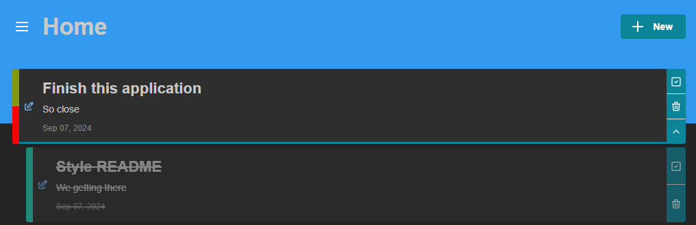
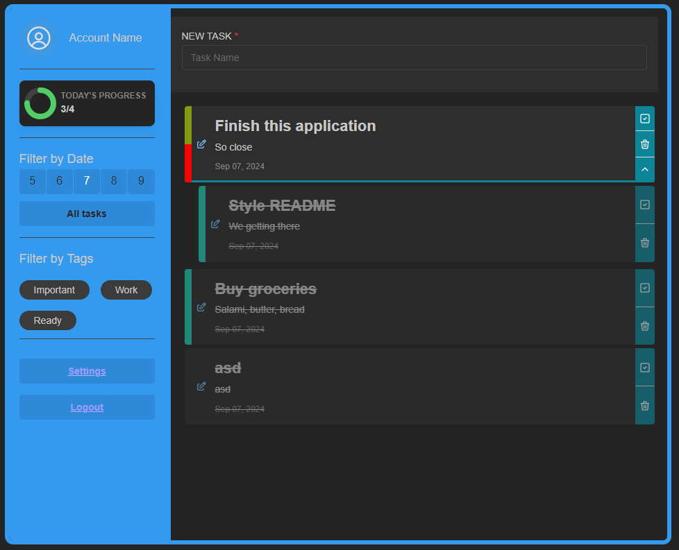
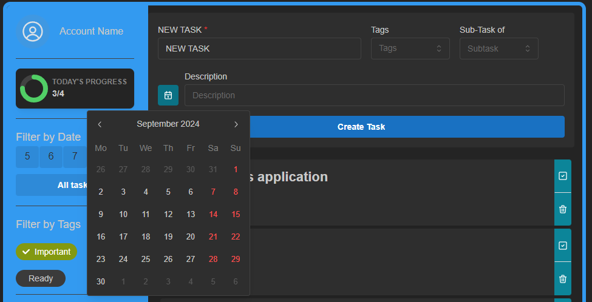
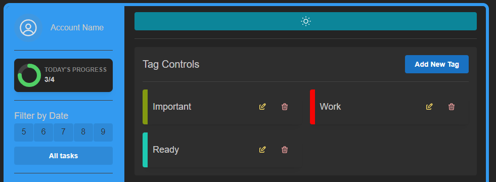

# Todo List App



A simple and elegant Todo List application built with React and Mantine. This app allows you to manage your tasks efficiently, track progress, and customize your experience with tags and subtasks.

---
## Responsive Design

For all view sizes



## Features

- **Create, Edit, and Delete Tasks**: Manage your tasks with ease.
- **Subtasks**: Organize your tasks with nested subtasks.
- **Tag Management**: Use tags to categorize and filter tasks.
- **Date & tag Filtering**: View tasks based on selected dates and tags.
- **Progress Tracking**: Visualize task completion with charts.
- **Responsive Design**: Works seamlessly on various screen sizes.

---

## Screenshots

### Task Creation



### Full Tag Controlls



---
## Installation

1. **Clone the repository**

    ```bash
    git clone https://github.com/Ryglus/MALFINI-FE-todolist
    ```

2. **Navigate to the project directory**

    ```bash
    cd MALFINI-FE-todolist
    ```

3. **Install dependencies**

    ```bash
    npm install
    ```

4. **Run the application**

    ```bash
    npm start
    ```

   The application will be available at [http://localhost:5173](http://localhost:5173) (most likely).

---

## Technologies Used

- **React**: JavaScript library for building user interfaces.
- **Mantine**: React components library for UI development.
- **Luxon**: Library for date and time manipulation.
- **Context API**: State management for tasks and tags.